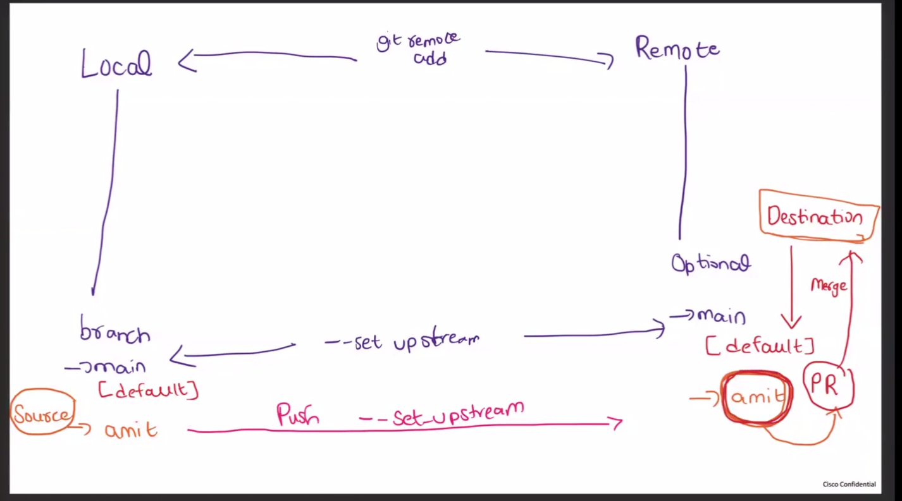

---

# 🚀 FULL DAY 1 – GIT NOTES

````md
# 🚀 Day 1 – Git Basics

---

## 📌 What is Git?

Git is a version control system used to track changes in code.

👉 Speak:
Git helps track changes and manage code versions.

---

## 🟢 1. git init

### What:
Initializes Git in a project and creates a `.git` folder

👉 Speak:
Git init starts version control in my project.

👉 Why:
To start tracking all changes from beginning

---

## 🟡 2. git status

### What:
Shows current state of files

👉 Speak:
Git status shows which files are modified or staged.

---

## 🔵 3. git add

### What:
Moves changes to staging area

👉 Command:
```bash
git add .
````

👉 Speak:
Git add prepares files for commit.

---

## 🟠 4. git commit

### What:

Saves changes as a snapshot

👉 Command:

```bash
git commit -m "message"
```

👉 Speak:
Git commit saves my changes permanently.

---

## 🔴 5. git push

### What:

Uploads code to GitHub

👉 Speak:
Git push sends my local code to remote repository.

---

## 🟣 6. git pull

### What:

Downloads latest code from GitHub

👉 Speak:
Git pull updates my local code from remote repository.

---

## 🟤 7. Branch

### What:

Separate version of project

👉 Commands:

```bash
git branch
git checkout -b dev
git checkout master
```

👉 Speak:
Branch allows working on features separately.

---

## ⚫ 8. git merge

### What:

Combines changes from one branch to another

👉 Speak:
Git merge combines changes from one branch to another.

---

## 💥 9. Merge Conflict

### When:

Same file edited in different branches

### Example:

```txt
<<<<<<< HEAD
code A
=======
code B
>>>>>>> dev
```

### Fix:

1. Edit file
2. Remove conflict markers
3. git add .
4. git commit

👉 Speak:
Merge conflict happens when Git cannot decide between changes.

---

## 🔥 10. Full Git Workflow

```bash
git init
git add .
git commit -m "message"
git push
```

👉 Speak:
This is the complete Git workflow.

---

## ⚠️ Important Learnings (From Practice)

* Git tracks from `.git` folder (project root)
* If not added → not committed
* Branch matters (main vs dev)
* Merge conflicts require manual resolution
* One project should have one `.git`

---

## 🎯 Interview Master Line

If stuck, say:

I have worked with Git practically. I used branching, merging, and resolved merge conflicts.

---

## 🧠 Daily Revision (2 Minutes)

1. What is Git?
2. What is commit?
3. What is branch?
4. What is merge conflict?

---

## 🚀 Goal

To build strong Git & GitHub understanding and become confident in interviews.

````

---

# 🧠 WHY THIS IS PERFECT

👉 Clean structure  
👉 No duplicate content  
👉 Speak lines included  
👉 Interview-ready  

---

# 🚀 NEXT STEP

```bash
git add .
git commit -m "Final Day 1 Notes"
git push
````

---