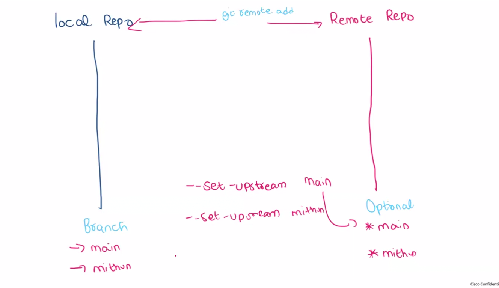

````md
# 🚀 Day 2 – Git Remote, Upstream & Branching

---

## 📌 Local vs Remote

- Local → Your system (code written here)
- Remote → GitHub (code stored online)

---

## 🔗 git remote add

Connects local repository to GitHub

```bash
git remote add origin <repo-url>
````

---

## 🚀 git push -u origin main

Pushes code to GitHub and sets upstream

```bash
git push -u origin main
```

👉 Meaning:

* origin → remote repo
* main → branch
* -u → set upstream

---

## 🔁 Upstream

Upstream links local branch with remote branch.

After setting upstream:

```bash
git push
git pull
```

👉 No need to write origin main again

---

## 🌿 Branch

Create and switch branches

```bash
git checkout -b dev
git checkout main
```

---

## 🔼 Push Branch

```bash
git push -u origin dev
```

---

## 🔀 Merge

```bash
git checkout main
git merge dev
git push
```

---

## 🔥 Full Workflow

```bash
git init
git add .
git commit -m "message"
git remote add origin <url>
git push -u origin main
git checkout -b dev
git push -u origin dev
git merge dev
```

---

## ⚠️ Key Points

* Upstream connects local and remote branch
* After upstream → use simple push/pull
* Always commit before switching branches
* Use branches for feature development

---

## 🎯 Interview Line

I connected local to GitHub using git remote add, set upstream using git push -u, and managed branches with push, pull, and merge.

---

## 🖼️ Diagram (Upstream + Flow)




````