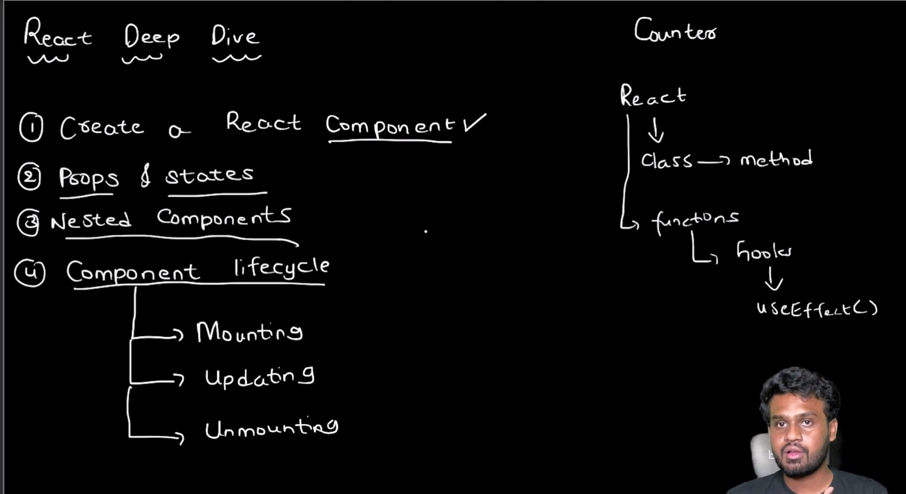
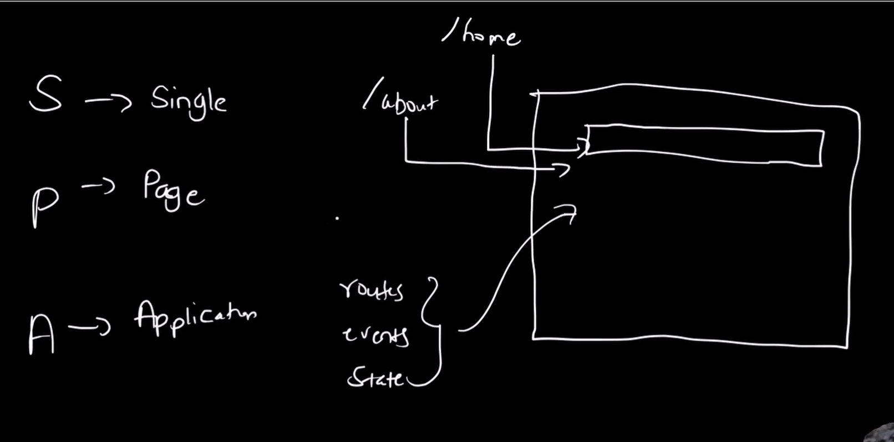
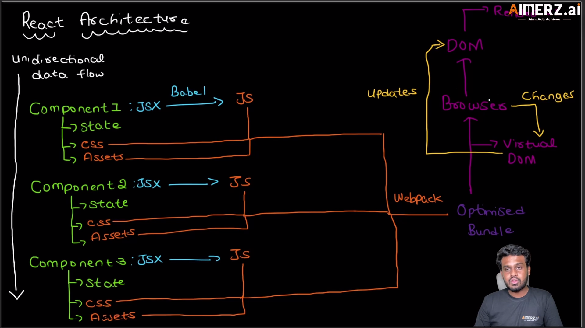
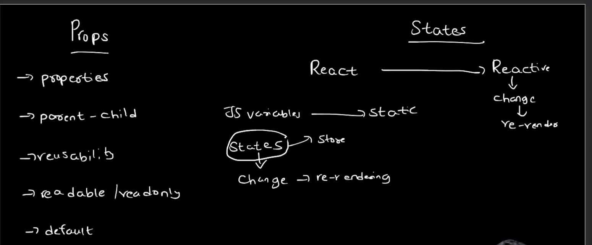
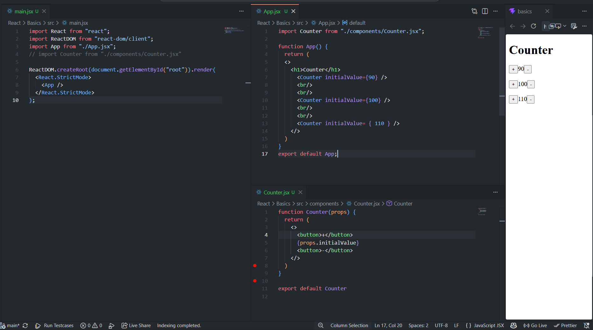

# ⚛️ React JS Fundamentals Notes (Interview Ready)

> Beginner Friendly + Full Revision Notes + Based on Your Lecture Images

---

# 📚 Topics Covered

1. What is React JS?
2. Why React?
3. SPA (Single Page Application)
4. React Architecture
5. Components
6. JSX
7. Props
8. States
9. Virtual DOM
10. Counter Project
11. Interview Questions

---

# 1️⃣ What is React JS?

React is a JavaScript Library used to build User Interfaces (UI).

Created By:
- Facebook (Meta)

Used For:
- Dynamic websites
- Fast applications
- Reusable UI
- Single Page Applications

---

# 📌 React Introduction


---

# 🧠 Real Life Understanding

Think of React like LEGO blocks.

You create:
- Navbar
- Sidebar
- Footer
- Cards
- Buttons

as reusable blocks called:

# ✅ Components

---

# 📌 React Topics Overview



---

# 2️⃣ Why React?

## ❌ Problems in Traditional Websites

Traditional websites:
- Reload full page
- Slower rendering
- Hard to manage UI
- Code duplication

---

# ✅ React Solves These Problems

React provides:
- Reusable Components
- Virtual DOM
- Faster Rendering
- Better UI Management
- Dynamic Updates

---

# 3️⃣ What is SPA?

SPA = Single Page Application

Only required section updates.

Entire page does NOT reload.

---

# 📌 SPA Architecture



---

# 🧠 Understanding SPA

S → Single  
P → Page  
A → Application

Instead of loading new HTML pages:

React changes only required content inside Browser DOM.

---

# ✅ Benefits of SPA

- Faster
- Smooth UI
- Better User Experience
- Dynamic Updates

---

# 4️⃣ React Architecture

React follows:
- Component Based Architecture
- Unidirectional Data Flow

Each component contains:
- JSX
- State
- CSS
- Assets

---

# 📌 React Architecture Diagram



---

# 🧠 React Architecture Flow

JSX → Babel → JavaScript → Webpack → Browser → DOM Updates

---

# ✅ Important Terms

## Babel
Converts JSX into JavaScript.

## Webpack
Bundles files into optimized bundle.

## Virtual DOM
Lightweight copy of Real DOM.

---

# 🧠 Virtual DOM Working

1. State changes
2. Virtual DOM creates copy
3. React compares old vs new DOM
4. Only changed part updates

This process is called:

# ✅ Diffing Algorithm

---

# 5️⃣ Components in React

A Component is a reusable UI block.

---

# ✅ Example Component

```jsx
function Button() {
  return <button>Click Me</button>;
}
```

---

# ✅ Types of Components

## Functional Components
Modern React uses Functional Components.

## Class Components
Older React approach.

---

# 🧠 Why Components are Important?

- Reusable
- Easy maintenance
- Clean code
- Better scalability

---

# 6️⃣ JSX

JSX = JavaScript XML

Allows writing HTML inside JavaScript.

---

# ✅ Example

```jsx
const element = <h1>Hello React</h1>;
```

---

# 🧠 Behind the Scenes

React converts JSX into JavaScript using:

# ✅ Babel

---

# 7️⃣ Props in React

Props = Properties

Used to pass data from:
- Parent Component
→ Child Component

---

# 📌 Props vs States



---

# 📌 Additional Props Notes



---

# ✅ Important Features of Props

- Read Only
- Immutable
- Parent → Child Communication
- Reusable
- Dynamic Data Passing

---

# 🧠 Props Flow

Parent sends data:

```jsx
<Counter initialValue={90} />
```

Child receives data:

```jsx
props.initialValue
```

---

# 8️⃣ States in React

State stores changing data.

When state changes:
✅ React automatically re-renders UI

---

# 📌 Why States are Important


---

# 🧠 Simple Understanding

## JavaScript Variable

```js
let count = 0;
```

Static value.

UI does NOT update automatically.

---

## React State

```jsx
const [count, setCount] = useState(0);
```

Reactive value.

UI updates automatically.

---

# ✅ State Examples

- Counter
- Form Input
- Theme Toggle
- Todo App
- Like Button

---

# 9️⃣ Counter Project Using Props

---

# 📌 Counter Project Screenshot


---

# ✅ App.jsx

```jsx
import Counter from "./components/Counter.jsx";

function App() {
  return (
    <>
      <h1>Counter</h1>

      <Counter initialValue={90} />
      <Counter initialValue={100} />
      <Counter initialValue={110} />
    </>
  );
}

export default App;
```

---

# ✅ Counter.jsx

```jsx
function Counter(props) {
  return (
    <>
      <button>+</button>
      {props.initialValue}
      <button>-</button>
    </>
  );
}

export default Counter;
```

---

# 🧠 Understanding This Project

We created:
- Reusable Counter Component
- Multiple Counter Instances
- Dynamic Values using Props

---

# ✅ Output

```jsx
<Counter initialValue={90} />
<Counter initialValue={100} />
<Counter initialValue={110} />
```

Each component receives different value using:

# ✅ Props

---

# 🔟 Counter Project Using State

---

# 📌 State Counter Screenshot


---

# ✅ Counter.jsx with State

```jsx
import { useState } from "react";

function Counter() {
  let [count, setCount] = useState(0);

  function increment() {
    setCount(count + 1);
  }

  function decrement() {
    setCount(count - 1);
  }

  return (
    <>
      <button onClick={increment}>+</button>

      <h2>{count}</h2>

      <button onClick={decrement}>-</button>
    </>
  );
}

export default Counter;
```

---

# 🧠 Understanding State Counter

When button clicks:
- State changes
- React re-renders UI
- Updated value appears instantly

---

# 🧠 Interview Questions

---

# ✅ Q1. What is React?

React is a JavaScript library used to build reusable and dynamic UI components.

---

# ✅ Q2. Why React is Fast?

Because React uses:
- Virtual DOM
- Efficient Rendering
- Component Reusability

---

# ✅ Q3. What is JSX?

JSX allows writing HTML inside JavaScript.

---

# ✅ Q4. Difference Between Props and State?

| Props | State |
|---|---|
| Read Only | Mutable |
| Parent → Child | Internal Component |
| Immutable | Can Change |
| Used for Communication | Used for Dynamic Data |

---

# ✅ Q5. What is Component?

Reusable UI block in React.

---

# ✅ Q6. What is SPA?

A Single Page Application updates content without full page reload.

---

# ✅ Q7. What happens when state changes?

React automatically re-renders component UI.

---

# ✅ Q8. What is Virtual DOM?

Virtual DOM is lightweight copy of real DOM used for faster updates.

---

# 🏗️ Recommended Folder Structure

```txt
React/
│
├── src/
│   ├── components/
│   ├── App.jsx
│   └── main.jsx
│
├── Notes/
│   └── Day_1/
│       ├── Images/
│       └── Readme.md
```

---

# 📌 Important React Keywords

- Component
- JSX
- Props
- State
- SPA
- Virtual DOM
- Babel
- Webpack
- Rendering
- Re-rendering
- Unidirectional Data Flow

---

# 🚀 Beginner Learning Order

1. Components
2. JSX
3. Props
4. State
5. Events
6. Hooks
7. API Calling
8. Routing
9. Context API
10. Redux

---

# 🎯 Final Interview Line

"React is a component-based JavaScript library used to build fast and dynamic Single Page Applications using Virtual DOM and reusable components."

---

# ✅ End of Notes