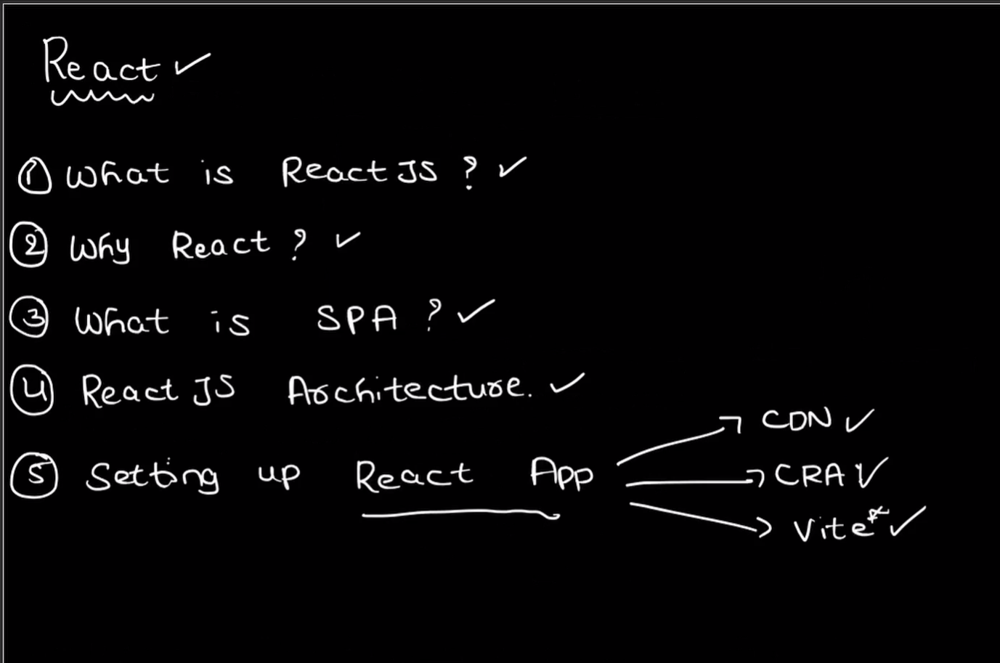
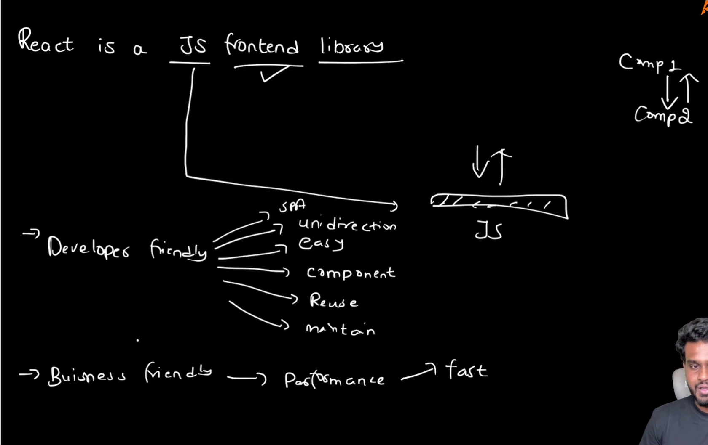
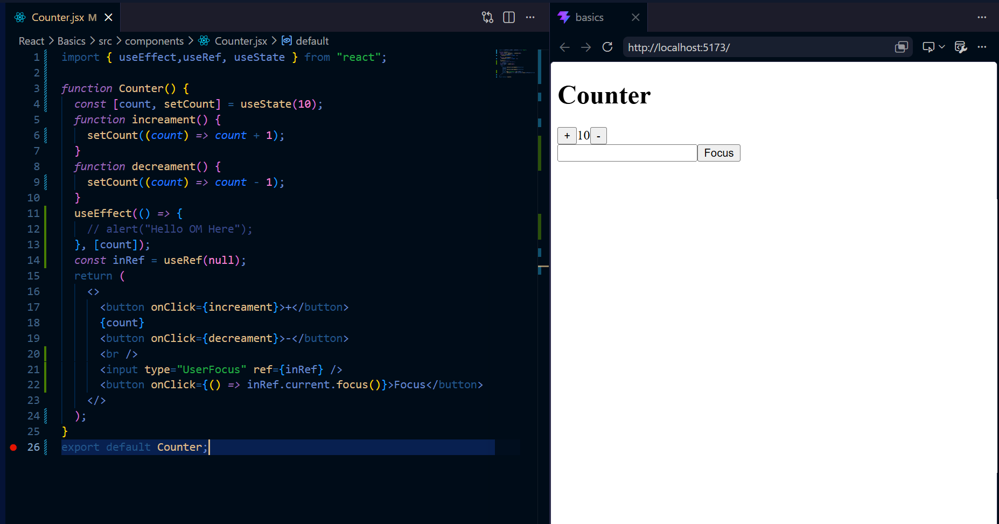

# ⚛️ React JS Day 1 - Fundamentals Notes

> Beginner Friendly • Revision Notes • Interview Ready

---

# 📚 Topics Covered

1. What is React?
2. Why React?
3. SPA (Single Page Application)
4. React Architecture
5. Components
6. JSX
7. Props
8. State
9. React Hooks
10. Counter Project
11. Interview Questions

---

# 1️⃣ What is React?

React is a JavaScript Library used to build User Interfaces (UI).

Created By:

- Meta (Facebook)

Used For:

- Dynamic Websites
- Dashboards
- Single Page Applications
- Web Applications

---

## 📌 What is React?



---

## 📌 React Introduction



---

## 🧠 Easy Understanding

Think of React like LEGO Blocks.

You create:

- Navbar
- Sidebar
- Footer
- Cards
- Buttons

and reuse them anywhere.

These blocks are called:

# ✅ Components

---

# 2️⃣ Why React?

Traditional Websites:

❌ Reload Full Page

❌ Slow UI Updates

❌ Repeated Code

❌ Difficult Maintenance

---

React Solves This:

✅ Reusable Components

✅ Faster Rendering

✅ Better Performance

✅ Easy Maintenance

✅ Dynamic Updates

---

# 3️⃣ SPA (Single Page Application)

SPA = Single Page Application

Only required content updates.

Whole page does NOT reload.

---

## 📌 SPA Architecture


---

## Benefits

- Faster
- Smooth User Experience
- Less Server Requests
- Dynamic Content Updates

---

# 4️⃣ React Architecture

React follows:

- Component Based Architecture
- Unidirectional Data Flow

---

## 📌 React Architecture


---

## React Flow

```text
JSX
 ↓
Babel
 ↓
JavaScript
 ↓
Bundler
 ↓
Browser
 ↓
DOM Update
```

---

## Important Terms

### Babel

Converts JSX → JavaScript

### Bundler

Bundles all files together.

### Virtual DOM

Lightweight copy of Real DOM.

---

# 5️⃣ Components

A Component is a reusable UI block.

---

## Example

```jsx
function Button() {
  return <button>Click Me</button>;
}
```

---

## Types

### Functional Components

Modern React

### Class Components

Older React

---

## Why Components?

- Reusable
- Clean Code
- Easy Maintenance
- Scalable

---

# 6️⃣ JSX

JSX = JavaScript XML

Allows HTML inside JavaScript.

---

## Example

```jsx
const element = <h1>Hello React</h1>;
```

---

## Behind The Scenes

```text
JSX
 ↓
Babel
 ↓
JavaScript
```

---

# 7️⃣ Props

Props = Properties

Used to pass data:

Parent ➜ Child

---

## 📌 Props vs State


---

## 📌 Counter Using Props


---

## Props Features

- Read Only
- Immutable
- Parent → Child Communication
- Reusable
- Dynamic Data

---

## Example

Parent:

```jsx
<Counter initialValue={100} />
```

Child:

```jsx
props.initialValue;
```

---

# 8️⃣ State

State stores changing data.

When State changes:

✅ React Re-renders UI

---

## 📌 State Re-render Demo


---

## JavaScript Variable

```js
let count = 0;
```

UI doesn't update automatically.

---

## React State

count

```jsx
const [count, setCount] = useState(0);
```

UI updates automatically.

---

## Common Uses

- Counter
- Forms
- Todo App
- Theme Toggle
- Like Button

---

# 9️⃣ React Hooks

Hooks allow Functional Components to use React features.

---

## 📌 Hooks Overview



---

## Common Hooks

### useState

Stores state.

```jsx
const [count, setCount] = useState(0);
```

---

### useEffect

Handles side effects.

Examples:

- API Calls
- Timers
- Event Listeners

```jsx
useEffect(() => {
  console.log("Mounted");
}, []);
```

---

### useRef

Access DOM elements directly.

```jsx
const inputRef = useRef(null);
```

Example:

```jsx
inputRef.current.focus();
```

---

# 🔟 Counter Project

Project uses:

✅ useState

✅ useEffect

✅ useRef

---

## 📌 Counter Project


---

## Flow

```text
Button Click
      ↓
setCount()
      ↓
State Changes
      ↓
Re-render
      ↓
UI Updates
```

---

## Features

- Increment Counter
- Decrement Counter
- Auto Re-render
- Input Focus Using useRef

---

# 🎤 Interview Questions

## Q1. What is React?

React is a JavaScript library used to build reusable and dynamic user interfaces.

---

## Q2. Why React is Fast?

Because React uses:

- Virtual DOM
- Efficient Rendering
- Component Reusability

---

## Q3. What is JSX?

JSX allows HTML-like syntax inside JavaScript.

---

## Q4. What is Component?

A reusable UI block.

---

## Q5. What is SPA?

A Single Page Application updates content without reloading the entire page.

---

## Q6. Difference Between Props and State?

| Props          | State              |
| -------------- | ------------------ |
| Read Only      | Mutable            |
| Parent → Child | Internal Component |
| Immutable      | Can Change         |

---

## Q7. What is Virtual DOM?

A lightweight copy of the real DOM used for faster updates.

---

## Q8. What is useState?

Hook used for managing state.

---

## Q9. What is useEffect?

Hook used for handling side effects.

---

## Q10. What is useRef?

Hook used for DOM access and storing mutable values.

---

# 📝 Quick Revision Sheet

```text
React = JavaScript UI Library

SPA = Single Page Application

JSX = HTML inside JavaScript

Component = Reusable UI Block

Props = Parent → Child Data

State = Dynamic Data

Virtual DOM = Fast UI Updates

useState = State Management

useEffect = Side Effects

useRef = DOM Access
```

---

# 🎯 Final Interview Answer

React is a component-based JavaScript library used to build fast and dynamic Single Page Applications using reusable components, Virtual DOM, and Hooks such as useState, useEffect, and useRef.

---

# ✅ End of Day 1 Notes
