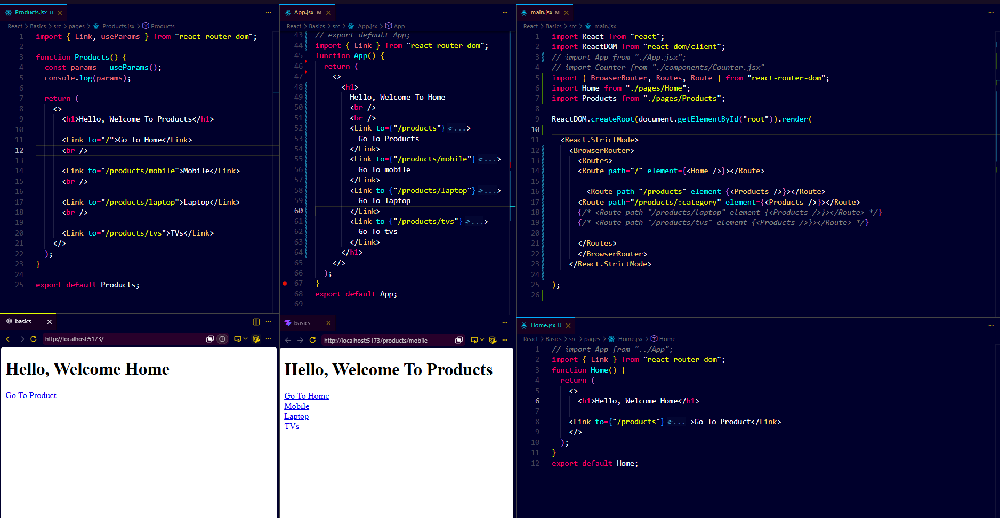

# Day 2 — React Router Fundamentals

> Goal: Understand routing visually and explain it easily.

---

# 1. Why Router?

Without Router:

❌ Full page reload
❌ Slow navigation
❌ State resets

With Router:

✅ Fast
✅ No reload
✅ SPA behavior

Think:

```text
Router = Traffic Controller of Pages
```

---

# Overall Routing Flow



Understand this:

```text
BrowserRouter
     ↓
Routes
     ↓
Route
     ↓
Link
     ↓
Component Render
```

This is the whole system.

---

# 2. BrowserRouter

Main wrapper.

Example:

```text
<BrowserRouter>
```

Job:

Tracks URL.

Think:

```text
BrowserRouter = Watchman of URL
```

Interview:

"BrowserRouter manages browser history."

---

# 3. Routes

Container of routes.

Image:

See your main.jsx screenshot.

Think:

```text
Routes = Box of all roads
```

Example:

```text
/
/products
/products/:category
```

Interview:

"Routes chooses which route should run."

---

# 4. Route

Maps URL → Component

Image:

See your main.jsx routes.

Example:

```text
"/" → Home

"/products" → Products
```

Think:

```text
Route = Road + Destination
```

Interview:

"Route maps path to component."

---

# 5. Link

Navigation button.

Image:

Home page screenshot.

Example:

```text
Go To Product
```

Think:

```text
Link = Smart anchor tag
```

Why?

Normal anchor reloads.

Link does not.

Interview:

"Link navigates without page refresh."

---

# Home → Products Navigation


Flow:

```text
Home
 ↓
Products
```

Simple.

---

# 6. Dynamic Routing

Image:

Products page screenshot.

Routes:

```text
/products/mobile
/products/laptop
/products/tvs
```

Think:

```text
Same page
Different data
```

Example:

```text
/products/:category
```

Interview:

"Dynamic routes allow variable values in URL."

---

# Dynamic Route Visual


Observe:

Mobile
Laptop
TVs

Same component.

Different category.

---

# 7. useParams()

Used to read URL.

Example:

URL:

```text
/products/laptop
```

Gets:

```text
category = laptop
```

Image:

Look at console in your screenshot.

Output:

```text
{category: "Laptop"}
```

Think:

```text
useParams = Read variable from URL
```

Interview:

"useParams extracts dynamic values from route."

---

# Final Mental Model

```text
Home
 ↓
Products
 ↓
Category
```

Simple.

One flow.

One component.

Multiple URLs.

---

# Quick Revision

```text
BrowserRouter → wraps app

Routes → route box

Route → path mapping

Link → navigation

Dynamic Route → variable path

useParams → read URL value
```

---

# What You Finished Today

✅ BrowserRouter
✅ Routes
✅ Route
✅ Link
✅ Dynamic Routing
✅ useParams

Good enough.

Next:

➡ useNavigate()
➡ Nested Routes
➡ Protected Routes

---

# Folder

```text
Day_2_Images/
└── RoutesProject_1.png
```

Keep this image only.

Enough for revision.
