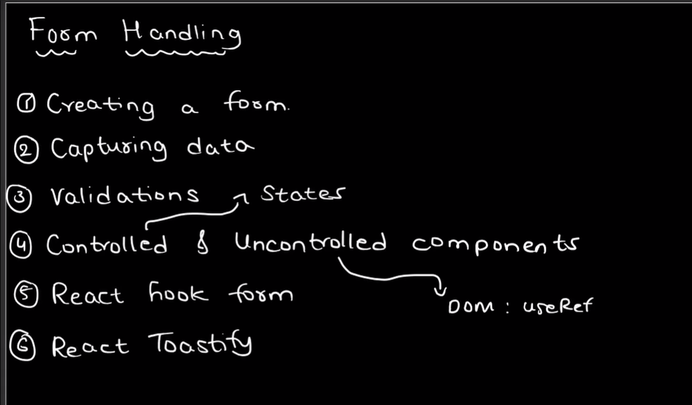
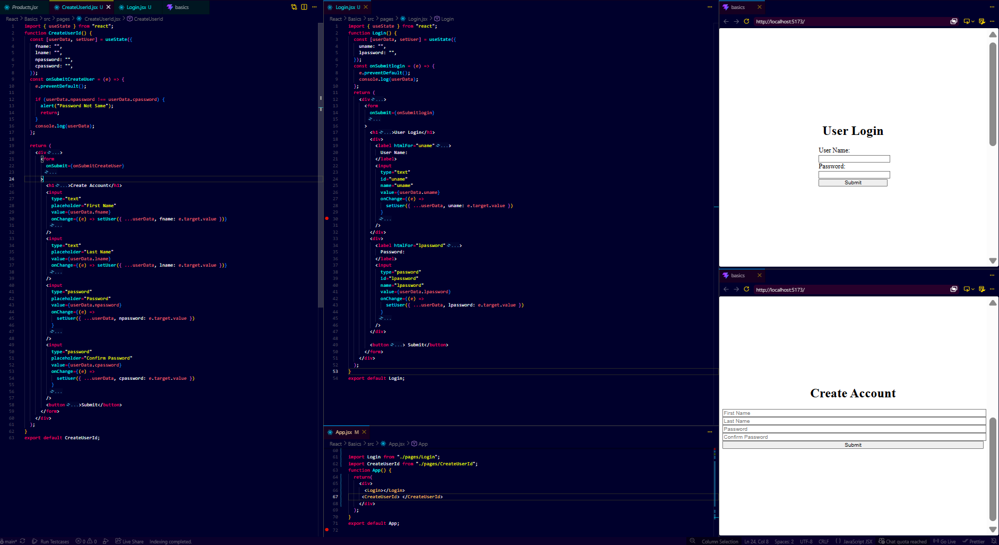

# ⚛️ Day 3 - React Forms And State

> Goal: Learn form handling, controlled inputs, validation.

---

# Topics Covered

```text
Form Handling
Controlled Components
useState
onChange
onSubmit
Validation
Tailwind Basics
```

---

# Form Handling Flow



Understand:

```text
Input Field
   ↓
onChange
   ↓
setState
   ↓
State Update
   ↓
UI Re-render
   ↓
Submit
   ↓
Validation
```

This is the full system.

---

# 1. Controlled Components

Meaning:

```text
React controls input values
```

Pattern:

```jsx
value={state.field}

onChange={(e)=>
setState({...state,field:e.target.value})
}
```

Remember this.

This is the most important pattern.

Interview:

```text
Controlled component = input managed by React state
```

---

# 2. useState Form Object

Instead of:

```jsx
const [fname,setFname]
const [lname,setLname]
```

Use:

```jsx
const [userData, setUser] = useState({
  fname: "",
  lname: "",
  password: "",
});
```

Why?

```text
Clean
Scalable
Easy to manage
```

---

# 3. Core Logic Pattern (Must Remember)

This is enough:

```jsx
const [data,setData] = useState({
 field:""
})

<input
 value={data.field}
 onChange={(e)=>
 setData({...data,field:e.target.value})
}
/>
```

This pattern repeats everywhere.

Forms.
Search.
Filters.
Login.
Signup.

Master this.

---

# Login Form

Visual:



Fields:

```text
Username
Password
```

Essential logic:

```jsx
const [userData, setUser] = useState({
  uname: "",
  password: "",
});
```

Submit:

```jsx
const onSubmit = (e) => {
  e.preventDefault();
  console.log(userData);
};
```

What learned:

```text
Basic controlled inputs
Form submit
State handling
```

---

# Create User Form

Same pattern.

Extra:

```text
Multiple fields
Password confirm
Validation
```

Validation:

```jsx
if (password !== cpassword) {
  alert("Password Not Same");
  return;
}
```

What changed?

```text
More inputs
Same state pattern
Added validation
```

Important:

Same logic.
Only scale increased.

That is how React works.

---

# Tailwind Used (Only Important)

```text
flex → layout

justify-center → center X

items-center → center Y

bg-gray-100 → background

p-6 → padding

rounded-lg → round box

shadow-md → shadow

w-full → full width

border → input border

bg-blue-500 → button color
```

Enough.

No need to memorize more.

---

# Interview Questions

### What is form handling?

Managing user input, validation and submission.

---

### What is controlled component?

Input controlled by React state.

---

### Why use useState?

To store dynamic input data.

---

### Why use spread operator?

To keep old object values while updating one.

---

### Why use preventDefault()?

Stops form reload.

---

### Why validation?

Ensures correct data.

---

# Quick Revision

```text
value = bind state

onChange = update state

setState = re-render

preventDefault = stop reload

validation = check input

controlled = React controls input
```

---

# Must Remember

Only remember this:

```jsx
value={state.field}

onChange={(e)=>
setState({...state,field:e.target.value})
}
```

If you know this:

You can build any form.
Login. Signup. Search. Contact. Filters.

That is enough. This reduces overload.
