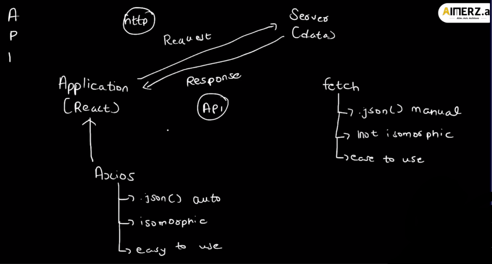
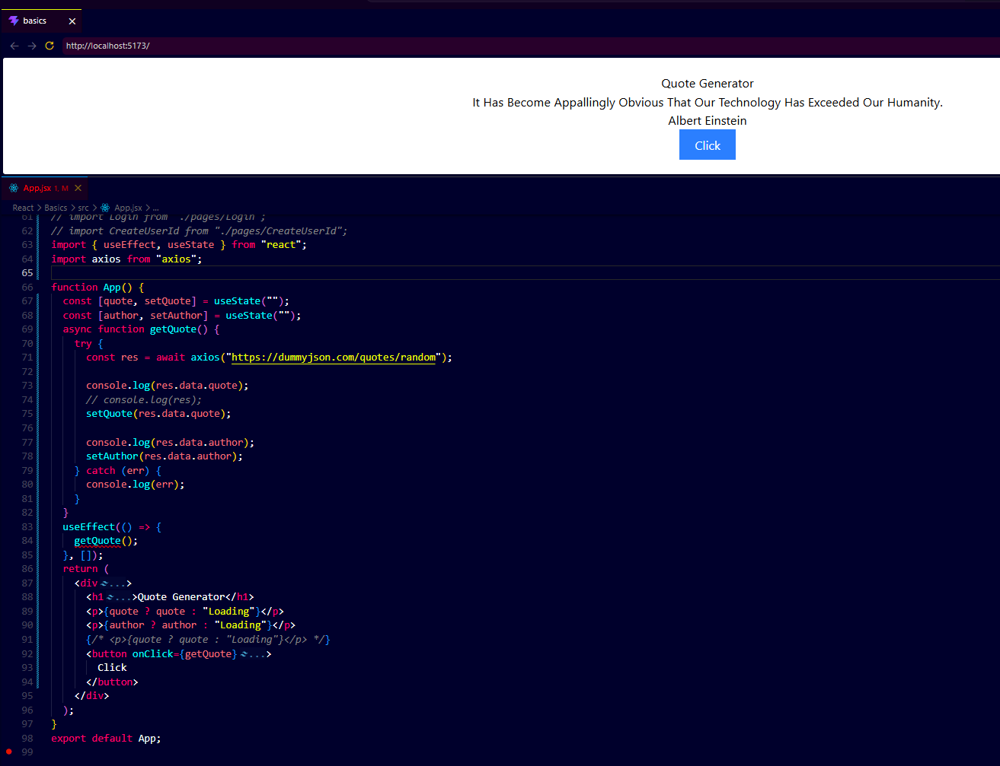
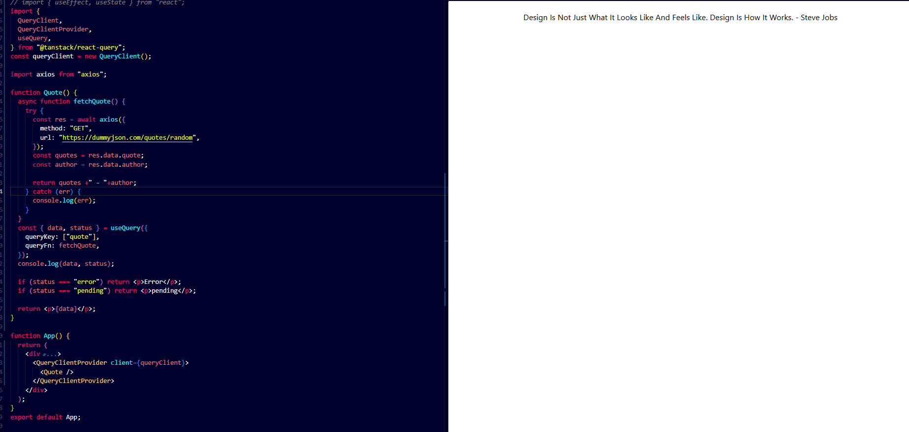
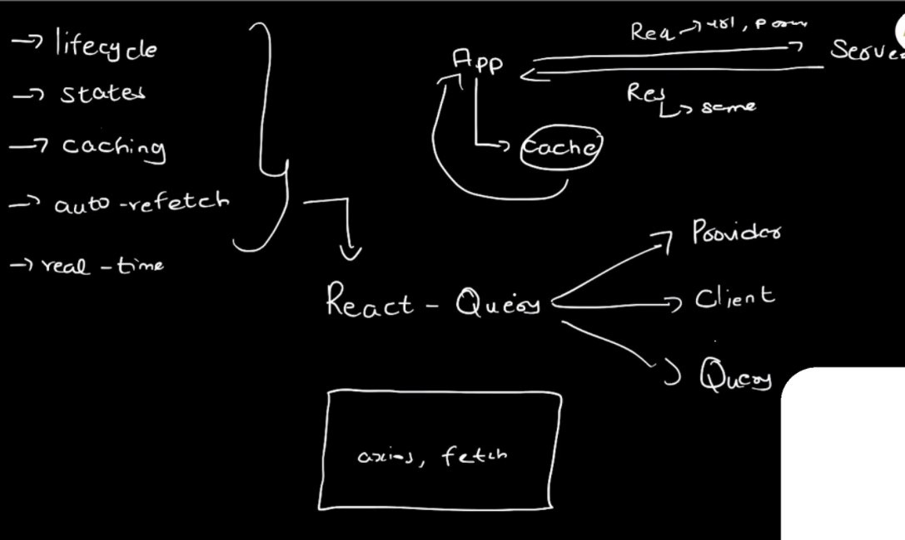
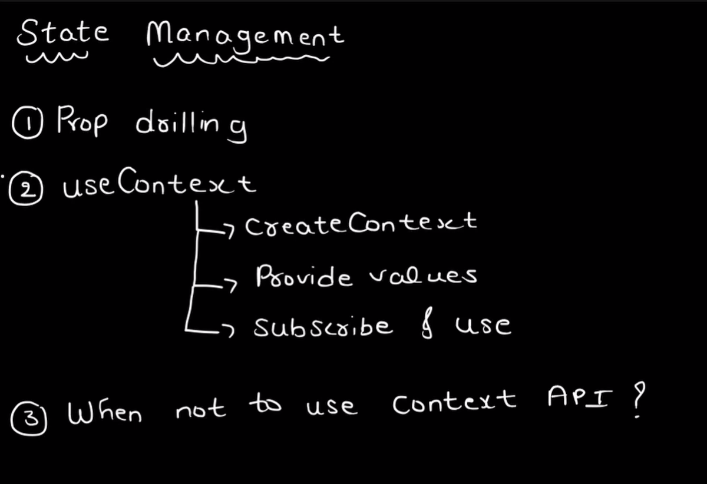
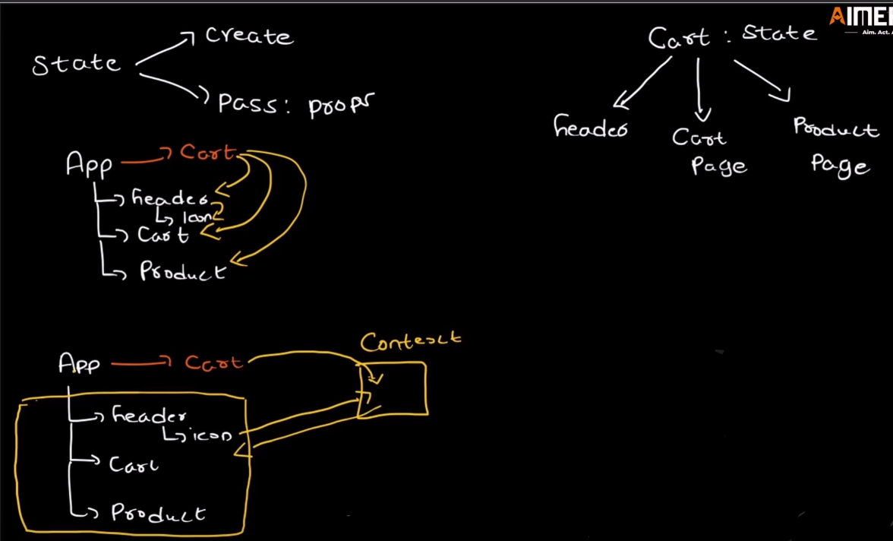
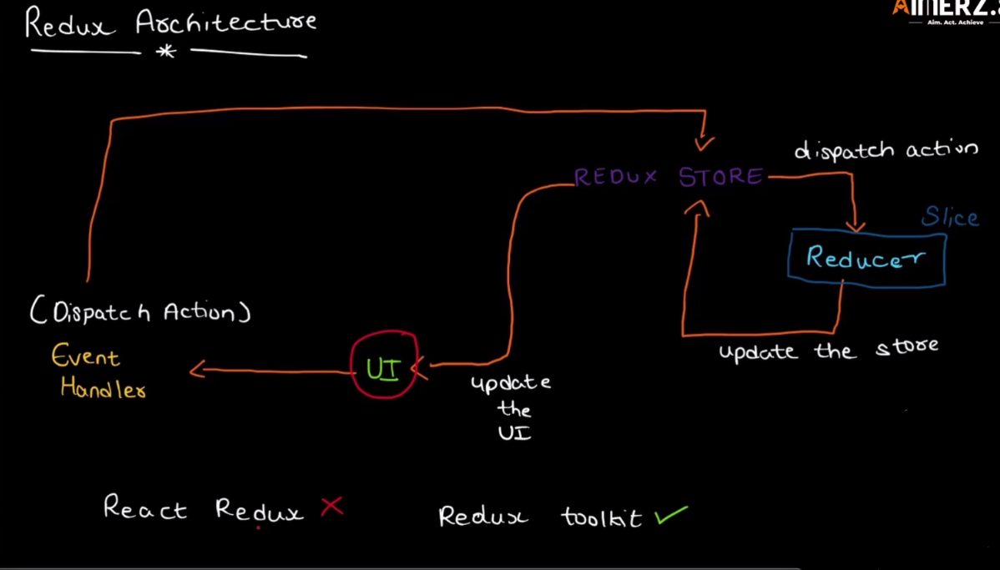

# ⚛️ Day 4 - Data Fetching & State Management

> Goal: Understand API communication, Axios fetching, React Query, Context API, and Redux Toolkit.

---

# Topics Covered

```text
1. API Basics
2. Fetch vs Axios
3. Axios GET Request
4. useState + useEffect
5. React Query
6. QueryClient
7. QueryClientProvider
8. useQuery
9. queryKey
10. queryFn
11. Loading & Error Handling
12. Caching
13. Auto Refetch
14. Prop Drilling
15. Context API
16. When Context API is not enough
17. Redux Toolkit
18. Server State vs Client State
```

---

# Learning Order

```text
API → Fetch → Axios → useEffect → React Query → Context API → Redux Toolkit
```

---

# 1. What is API?

API = Application Programming Interface

Used for communication between frontend and backend.

Flow:

```text
React App
   ↓ Request
Server
   ↓ Response
React UI Updates
```

Think:

```text
API = Messenger between frontend and backend
```

---

# API Flow Diagram



---

# 2. Fetch vs Axios

Both are used to fetch data.

## Fetch

```js
const res = await fetch(url);
const data = await res.json();
```

Problems:

❌ Manual JSON parsing
❌ More code
❌ Less clean

---

## Axios

```js
const res = await axios(url);
console.log(res.data);
```

Benefits:

✅ Auto JSON parsing
✅ Better error handling
✅ Cleaner syntax
✅ Easy to use

Think:

```text
Axios = Better Fetch
```

---

# Axios Project

Code:

```jsx
const [quote, setQuote] = useState("");
const [author, setAuthor] = useState("");

async function getQuote() {
  const res = await axios("https://dummyjson.com/quotes/random");

  setQuote(res.data.quote);
  setAuthor(res.data.author);
}
```

---

# Why useEffect?

```jsx
useEffect(() => {
  getQuote();
}, []);
```

Purpose:

```text
Runs API on first render
```

Flow:

```text
Render
↓
useEffect
↓
API call
↓
State update
↓
Re-render
```

---

# Axios Project Output



---

# Problem with Axios + useEffect

Manual work:

❌ Loading state
❌ Error state
❌ Caching
❌ Refetching
❌ Duplicate API calls

This is where React Query comes.

---

# 3. React Query

React Query manages server state.

Handles:

```text
Lifecycle
States
Caching
Auto Refetch
Real-time Sync
```

Think:

```text
Axios fetches data
React Query manages data
```

---

# React Query Project



---

# Query Flow Architecture



---

# Install React Query

```bash
npm install @tanstack/react-query
```

---

# QueryClient

Creates cache manager.

```jsx
const queryClient = new QueryClient();
```

Purpose:

```text
Stores API cache
```

---

# QueryClientProvider

Wraps app.

```jsx
<QueryClientProvider client={queryClient}>
  <Quote />
</QueryClientProvider>
```

Purpose:

```text
Provides query access globally
```

---

# useQuery

Main hook.

```jsx
const { data, status } = useQuery({
  queryKey: ["quote"],
  queryFn: fetchQuote,
});
```

Handles:

✅ API calls
✅ Loading
✅ Errors
✅ Cache
✅ Refetch

---

# queryKey

Unique cache id.

```jsx
queryKey: ["quote"]
```

Think:

```text
queryKey = unique storage key
```

---

# queryFn

Actual function.

```jsx
async function fetchQuote() {
  const res = await axios({
    method: "GET",
    url: "https://dummyjson.com/quotes/random",
  });

  return res.data.quote + " - " + res.data.author;
}
```

---

# Status Handling

```jsx
if (status === "error") return <p>Error</p>;
if (status === "pending") return <p>Pending</p>;
```

---

# Axios vs React Query

| Axios          | React Query  |
| -------------- | ------------ |
| Fetches Data   | Manages Data |
| Manual Loading | Automatic    |
| Manual Error   | Automatic    |
| No Cache       | Cache        |
| No Refetch     | Auto Refetch |

Think:

```text
Axios = Engine
React Query = Driver
```

---

# 4. State Management

Problems:

* Prop drilling
* Passing state deeply

---

# State Management Overview



---

# Prop Drilling Problem

Passing data through multiple components.

Problem:

```text
App → Header → Icon → Cart
```

Hard to maintain.

---

# Context API

Solves prop drilling.

Steps:

```text
1. createContext()
2. Provide values
3. Subscribe and use
```

---

# Context API Diagram



---

# When Context API is not enough?

Use Redux Toolkit when:

* Large app
* Complex state
* Many components
* Multiple actions

---

# React Query vs Redux Toolkit

| React Query  | Redux Toolkit  |
| ------------ | -------------- |
| Server State | Client State   |
| API Data     | UI Data        |
| Cache        | Global State   |
| Auto Refetch | Manual Updates |

Think:

```text
React Query = Backend Data
Redux Toolkit = Frontend Data
```

---

# Redux Architecture



Flow:

```text
UI Event
↓
Dispatch Action
↓
Redux Store
↓
Reducer
↓
State Update
↓
UI Re-render
```

---

# Install Redux Toolkit

```bash
npm install @reduxjs/toolkit react-redux
```

---

# Quick Revision

```text
API = communication

Fetch = manual API call

Axios = better fetch

useEffect = trigger API

React Query = server state manager

Context API = solves prop drilling

Redux Toolkit = client/global state manager
```

---

# What You Finished Today

✅ API Basics
✅ Fetch vs Axios
✅ useEffect
✅ React Query
✅ QueryClient
✅ QueryClientProvider
✅ useQuery
✅ queryKey
✅ queryFn
✅ Loading & Error Handling
✅ Caching
✅ Auto Refetch
✅ Prop Drilling
✅ Context API
✅ Redux Toolkit

---

# Next

```text
Redux Toolkit Practical
createSlice
configureStore
useSelector
useDispatch
Mutations
POST API
PUT API
DELETE API
Pagination
```
